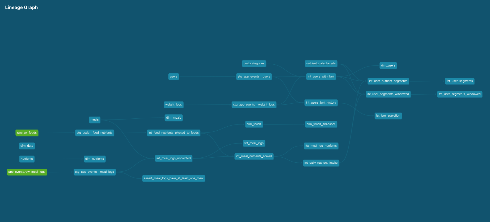

# Diet Analytics Pipeline

A 3-day portfolio project built to showcase dbt, developed with the help of Claude.

**The domain is a nutrition tracking app.** Users log their daily meals and the app shows how much protein, fat, carbohydrate, fiber, and sugar they consumed. On the business side, the analytics pipeline classifies each user into behavioural segments — low protein, high fat, low fiber, high sugar (carbohydrate is tracked but not targeted in this iteration) — to power targeted product recommendations.

The pipeline combines real food data from the USDA FoodData Central API with synthetic meal log events that simulate user behaviour.

> **Note:** Setup instructions are written for macOS.
>
> **Dimensional model:** bus matrix, grain statements, SCD types, segment definitions, and reporting queries are in [`docs/dimensional_model.md`](docs/dimensional_model.md).
>
> **Table guide:** practical reference for each mart table — what one row represents, example data shape, and common joins — in [`docs/table_guide.md`](docs/table_guide.md).

---

## Stack

| Layer | Tool |
|---|---|
| Warehouse | DuckDB |
| Transformation | dbt-core + dbt-duckdb |
| Orchestration | Airflow (planned) |
| Reporting | Streamlit |
| Language | Python 3.13 |

---

## Architecture

```
USDA FoodData Central API
        │
        ▼
  usda/usda_extract.py  ──►  raw.raw_foods  (DuckDB)
                                    │
app_events/generate_historical_meal_logs.py ──►  app_events.raw_meal_logs  (DuckDB)
                                    │
                              dbt build
                                    │
                    ┌───────────────┼───────────────┐
                    ▼               ▼               ▼
                staging         intermediate      marts
            (views, clean)    (ephemeral,       (tables,
                               unnest/join)    aggregated)
                                    │
                            Streamlit dashboard
```

---

## Project structure

```
diet-analytics-engineer/
├── usda/                        # Extraction: USDA API → DuckDB
│   └── queries/                 # SQL files for table creation and inserts
├── app_events/                  # Synthetic meal log generator
│   └── queries/
├── setup/                       # One-time DB and schema setup
│   └── queries/
├── diet_dbt/                    # dbt project root
│   ├── models/
│   │   ├── staging/             # stg_usda__*, stg_app_events__*  (views)
│   │   ├── intermediate/        # int_*  (ephemeral)
│   │   └── marts/
│   │       ├── core/            # dim_date, dim_users, dim_nutrients
│   │       ├── user_health/     # dim_foods, fct_meal_logs, fct_meal_log_nutrients, fct_bmi_evolution
│   │       └── marketing/       # fct_user_segments, fct_user_segments_windowed
│   ├── seeds/                   # users, weight_logs, meals, nutrients, bmi_categories, nutrient_daily_targets
│   ├── snapshots/               # dim_foods_snapshot (SCD Type 2)
│   └── profiles.yml.example
├── dashboard/                   # Streamlit app
├── docs/                        # dbt conventions, SQL conventions, dimensional model, dbt commands, AI tooling
├── data/                        # DuckDB database files (gitignored)
├── .mcp.json                    # dbt MCP config for VS Code / Claude Code
├── .env.example                 # Template for pipeline environment variables
├── .env.dbt.example             # Template for dbt MCP environment variables
└── requirements.txt
```

---

## Setup

### Prerequisites

- Python 3.13
- A USDA FoodData Central API key — free at https://fdc.nal.usda.gov/api-guide.html

### 1. Clone and install

```bash
git clone https://github.com/your-username/diet-analytics-engineer.git
cd diet-analytics-engineer
python -m venv venv
source venv/bin/activate
pip install -r requirements.txt
```

### 2. Configure environment

```bash
cp .env.example .env
```

Edit `.env` and fill in:
- `TARGET_ENV` — `dev` for local development
- `FDC_API_KEY` — your USDA API key

### 3. Configure dbt

```bash
cp diet_dbt/profiles.yml.example ~/.dbt/profiles.yml
```

Edit `~/.dbt/profiles.yml` and replace the `path` values with the absolute path to the `data/` folder on your machine.

### 4. Run the pipeline

**Initial load (run once):**

```bash
python setup/setup_db.py                                  # create DB, schemas, tables
python usda/usda_extract.py                               # load USDA food data into raw_foods
python app_events/generate_historical_meal_logs.py        # generate historical meal logs up to yesterday
cd diet_dbt                                               # move to diet_dbt folder
dbt deps                                                  # install dbt packages (dbt_utils)
dbt source freshness                                      # check source data is up to date
dbt build --full-refresh                                  # seeds + models + tests (full rebuild)
```

> `dbt source freshness` may warn on `raw_meal_logs` after the initial load depending on what time you run it and the last `logged_at` generated by the historical data script — this is expected since the daily script has not run yet.
>
> `--full-refresh` is required on the initial load — incremental models need an existing table to append to, which doesn't exist yet on first run. Subsequent `dbt build` runs without `--full-refresh` will use incremental logic as expected.

**Daily (run each day after the initial load):**

```bash
cd ..                                                     # move back to diet-analytics engineer folder 
python app_events/generate_meal_logs.py                   # generate meal logs for today
cd diet_dbt                                               # move to diet_dbt folder
dbt source freshness                                      # check source data is up to date
dbt build --select source:app_events.raw_meal_logs+       # rebuild only downstream of today's data
dbt docs generate && dbt docs serve                       # generate and browse the data catalog
# press Ctrl+C to stop the docs server
```

> `dbt docs serve` opens a browser with full model documentation, column descriptions, test results, and a lineage graph showing how every model connects.

> `generate_meal_logs.py` truncates `raw_meal_logs` before inserting, making it safe to re-run — but only at the raw layer. Re-running `dbt build` after would insert duplicates into the incremental mart tables, since the same day's data would be processed twice. In a real app, a user logs exactly 3 meals per day, so re-running would also regenerate the same day's logs with different random foods — not meaningful data. In production, meal updates would arrive as new app events and require a different ingestion strategy (insert new rows, update existing ones, or event streaming) rather than a full daily regeneration.

### 5. Run the dashboard

```bash
pip install streamlit
streamlit run dashboard/app.py
# press Ctrl+C to stop the dashboard
```

---

## dbt models

| Layer | Model | Description |
|---|---|---|
| Staging | `stg_usda__food_nutrients` | Cleans and casts raw USDA JSON |
| Staging | `stg_app_events__users` | Casts user seed data |
| Staging | `stg_app_events__meal_logs` | Casts raw meal log STRUCT arrays, normalises timestamps to UTC |
| Staging | `stg_app_events__weight_logs` | Casts weight log seed data, normalises timestamps to UTC |
| Intermediate | `int_food_nutrients_pivoted_to_foods` | Pivots nutrient rows to one row per food |
| Intermediate | `int_meal_logs_unpivoted` | Unnests meal STRUCT arrays, joins meal_id |
| Intermediate | `int_meal_nutrients_scaled` | Scales nutrient values by actual serving size |
| Intermediate | `int_daily_nutrient_intake` | Aggregates to daily totals per user per nutrient |
| Intermediate | `int_users_with_bmi` | Joins users to BMI category via range join |
| Intermediate | `int_user_nutrient_segments` | Daily classification per user per nutrient |
| Intermediate | `int_user_segments_windowed` | Windowed classification: last day / 7d / 30d per user per nutrient |
| Intermediate | `int_users_bmi_history` | BMI computed per weight log entry |
| Mart | `dim_date` | Date spine 2019–2027 with calendar attributes |
| Mart | `dim_foods` | Food dimension with nutrient content per 100g |
| Mart | `dim_meals` | Meal type dimension (breakfast, lunch, dinner) |
| Mart | `dim_nutrients` | Nutrient dimension (id, USDA code, name, unit) |
| Mart | `dim_users` | User dimension with BMI, BMI category, recommended protein |
| Mart | `fct_meal_logs` | Food items logged per user per meal per day |
| Mart | `fct_meal_log_nutrients` | Nutrient intake per user per meal per nutrient per day (long format) |
| Mart | `fct_user_segments` | Daily nutrient segment classification per user |
| Mart | `fct_user_segments_windowed` | Windowed segment snapshot: last day / 7d / 30d |
| Mart | `fct_bmi_evolution` | BMI over time per user, one row per weight log entry |
| Snapshot | `dim_foods_snapshot` | SCD Type 2 history of food nutrient changes |


> The lineage graph is also available interactively via `dbt docs generate && dbt docs serve`.

### Seeds

**Business logic:**

| Seed | Description |
|---|---|
| `bmi_categories.csv` | WHO BMI ranges used to classify users in `dim_users` |
| `nutrient_daily_targets.csv` | Recommended daily intake per nutrient with threshold direction and segment label |

**Lookups:**

| Seed | Description |
|---|---|
| `meals.csv` | Maps meal names to `meal_id` |
| `nutrients.csv` | Maps USDA nutrient codes to `nutrient_id`, name, and unit |

**User data:**

| Seed | Description |
|---|---|
| `users.csv` | 10 synthetic users with height, weight, country, and registration date |
| `weight_logs.csv` | 3 weight check-ins per user between May and June 2026, used to build BMI evolution history |

> In a real app, users and weight logs would live in the application database and be synced into the warehouse via the app events pipeline. They are loaded as dbt seeds here to keep the proof of concept self-contained.

---

## Data sources

**USDA FoodData Central** — Food data pulled via the `/foods/list` API endpoint (abridged format). `fdc_id` is the stable natural key. The SR Legacy dataset was chosen for broad food coverage and consistent nutrient values. Nutrients tracked: protein, fat, carbohydrate, fiber, total sugar. USDA food data is assumed to update monthly, which is why `usda_extract.py` and `dbt snapshot` are scheduled monthly rather than daily.

**Synthetic users** — `diet_dbt/seeds/users.csv` simulates 10 users. Each includes weight and height to enable BMI calculation and personalised protein thresholds.

**Synthetic weight logs** — `diet_dbt/seeds/weight_logs.csv` records 3 weight check-ins per user between May and June 2026, demonstrating BMI evolution over time.

**Synthetic meal logs** — generated by `app_events/generate_historical_meal_logs.py`. Simulates 10 users logging three meals per day from their registration date through to yesterday, each meal containing 3 food items with random serving sizes (80–250g).

> The pipeline considers only the last 365 days of meal data. Nutrient intake aggregations in the intermediate layer are filtered to this window, with the windowed segmentation model further narrowing to the last 30 days.

---

## Streamlit dashboard

The dashboard connects directly to DuckDB. Run it with:

```bash
source venv/bin/activate
streamlit run dashboard/app.py
```

The sidebar exposes a date range filter (default: app launch date → latest logged date). A user selector appears inline on pages where the view is per-user.

### Tables used per view

**Page 1 — User Health**

| View | Tables |
|---|---|
| Overview | `dim_users`, `dim_date` |
| Nutrients | `fct_meal_log_nutrients`, `dim_nutrients` |
| Trends | `fct_meal_log_nutrients`, `dim_nutrients` |
| Food Log | `fct_meal_logs`, `dim_meals`, `dim_foods` |
| BMI | `fct_bmi_evolution`, `dim_date` |

**Page 2 — Marketing**

| View | Tables |
|---|---|
| Windowed (per user) | `fct_user_segments_windowed`, `dim_nutrients` |
| Flagged Users (all) | `fct_user_segments`, `dim_nutrients` |

All mart tables are covered. `dim_foods_snapshot` is excluded — it is the SCD Type 2 history table.

---


---

## dbt MCP (VS Code + Claude Code)

The project includes `.mcp.json` at the root, which lets Claude Code run dbt commands directly from chat. Requires [uv](https://docs.astral.sh/uv/) and a `.env.dbt` file with `DBT_PROJECT_DIR` and `DBT_PATH` set. See [`docs/ai_tooling.md`](docs/ai_tooling.md) for full setup steps.

---

## Roadmap

- [ ] Airflow DAGs (daily pipeline + monthly snapshot)
- [ ] dbt Semantic Layer (MetricFlow)
- [ ] dbt model contracts on mart models
- [ ] Review additional dbt packages and tests to add
- [ ] Add dbt tags to models for run selection by domain (e.g. `tag:marketing`, `tag:daily`)
